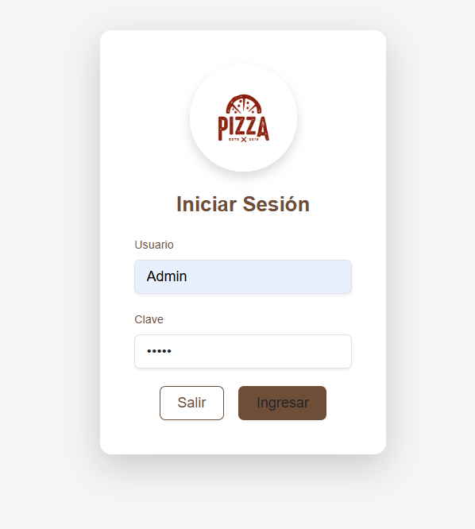
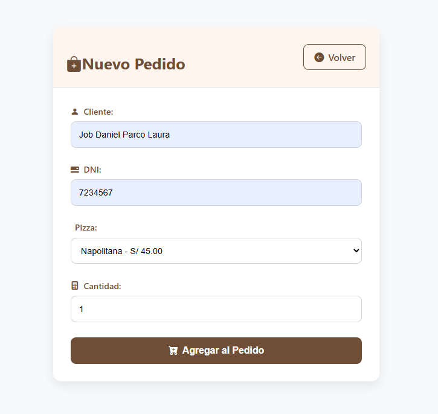
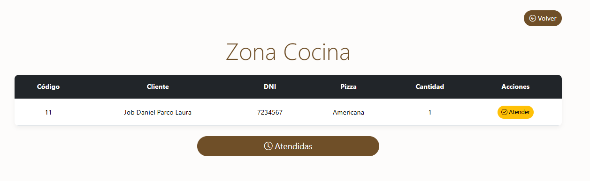
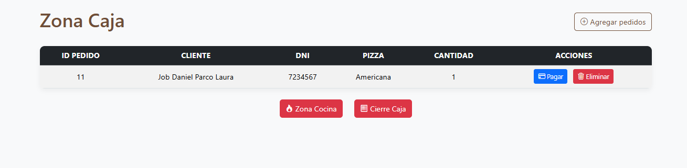
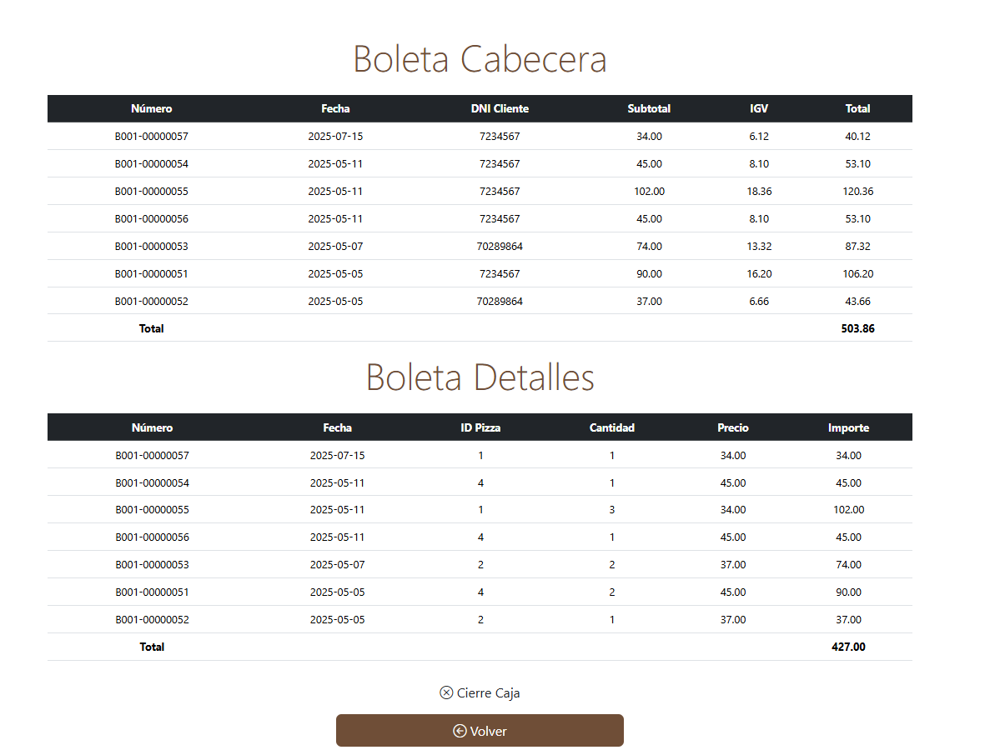
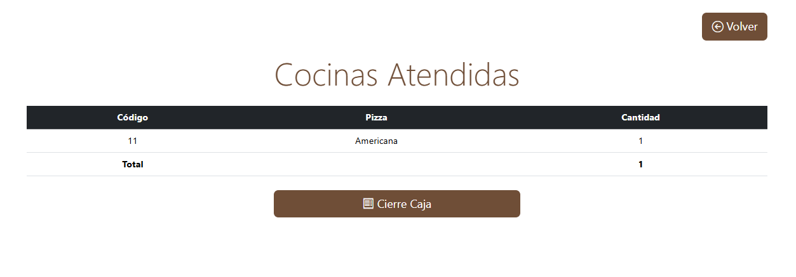

# 🍕 PIZERRIA

Sistema web desarrollado en PHP para la gestión de pedidos, cocina, caja y boletas de una pizzería.

---

## 🚀 Funcionalidades

- Registro y gestión de pedidos
- Visualización de pedidos en cocina
- Administración de caja
- Emisión de boletas
- Reportes por fecha
- Exportación a PDF

---

## ⚙️ Tecnologías

- PHP
- MySQL
- HTML/CSS
- JavaScript
- Bootstrap
- FPDF

---

## 📸 Capturas de Pantalla

### 🔐 Login

### 📝 Registro de Pedido

### 🍽️ Zona de Cocina

### 💵 Zona de Caja

### 📄 Boletas Generadas

### 🧾 Cocina Atendida

---
